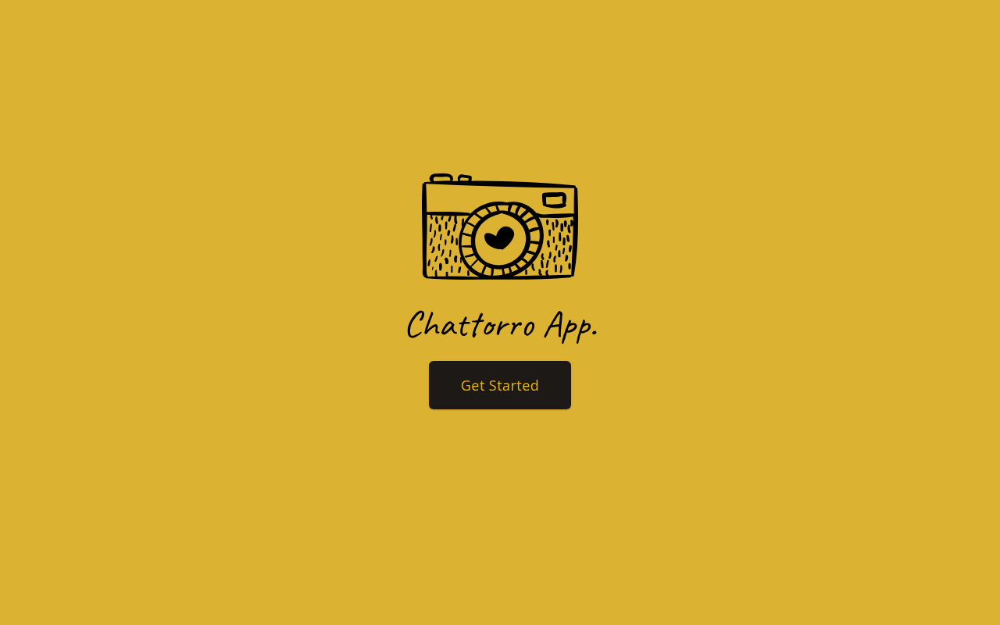
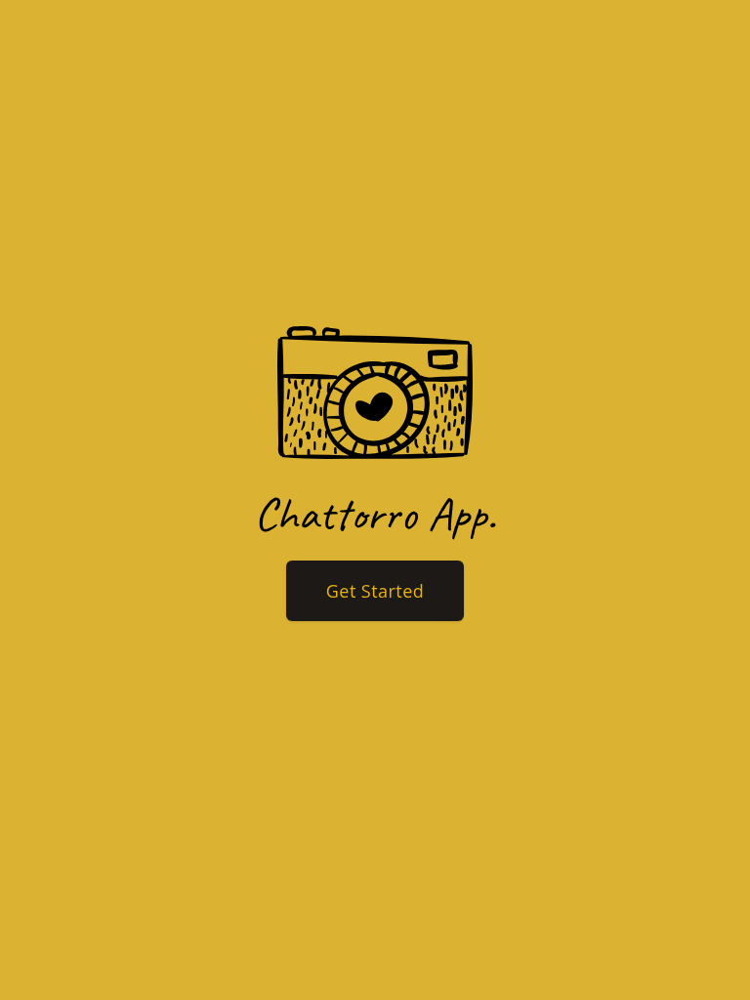
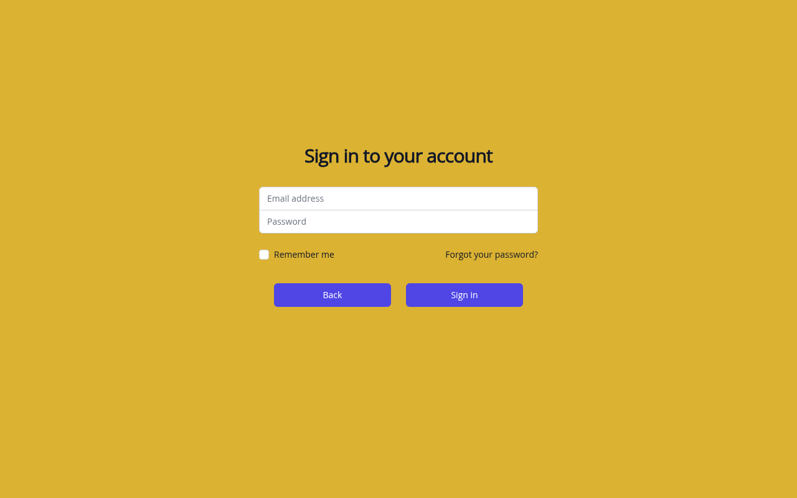
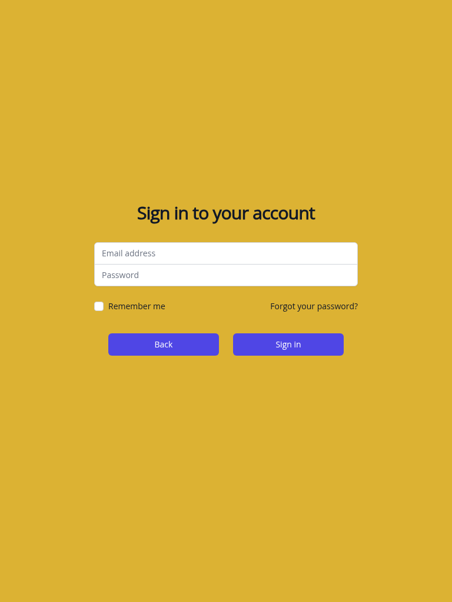
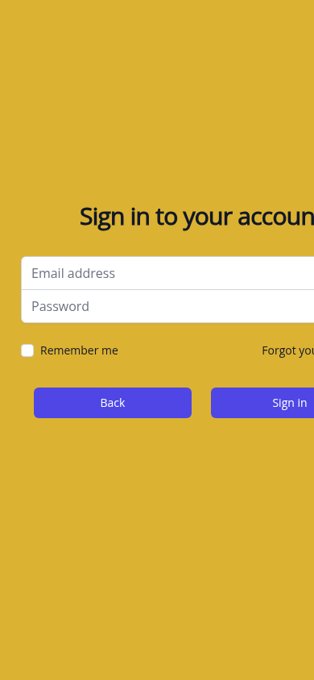
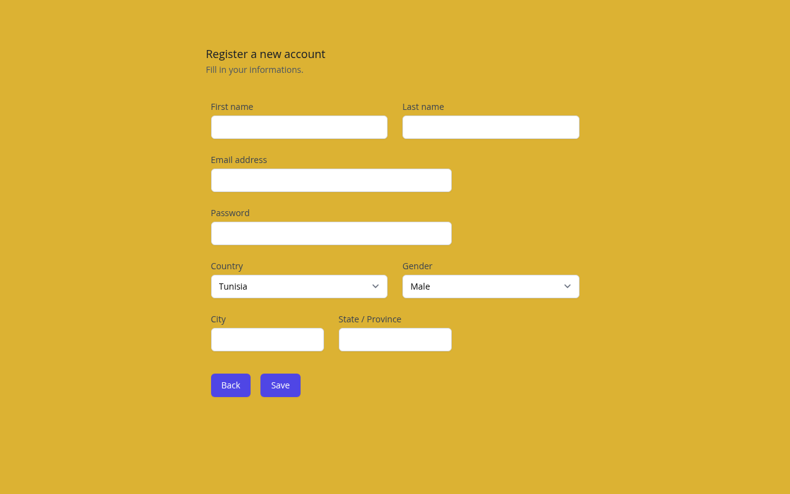
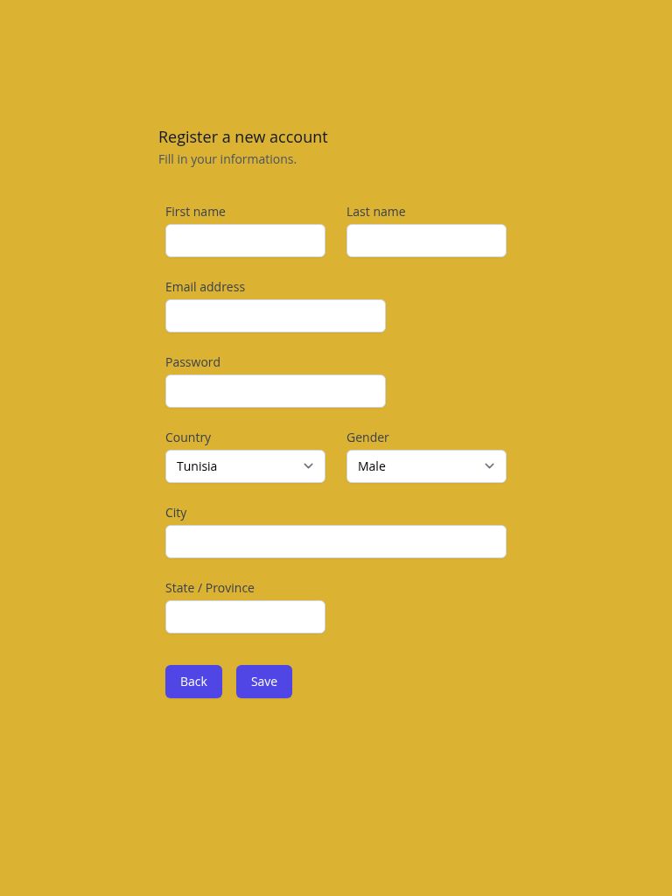
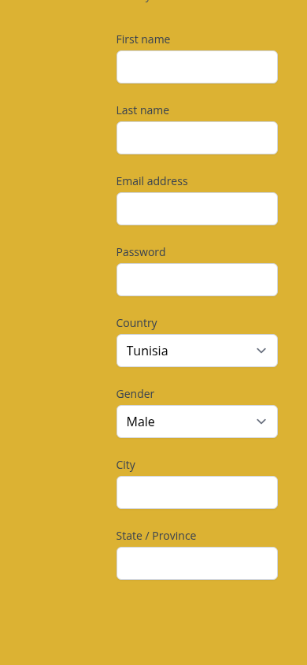

This is a [Next.js](https://nextjs.org/) project bootstrapped with [`create-next-app`](https://github.com/vercel/next.js/tree/canary/packages/create-next-app).

## Prerequisites

- **Node.js** — use the version in [`.nvmrc`](./.nvmrc) (currently **20**). With [nvm](https://github.com/nvm-sh/nvm): `nvm install` then `nvm use`.
- **MySQL** — a running server the app can reach (default: `127.0.0.1:3306`).

## Environment variables

Create a `.env` file in the project root (Next.js loads it automatically). No spaces around the `=` sign.

```env
MYSQL_HOST=127.0.0.1
MYSQL_PORT=3306
MYSQL_DATABASE=chattoro
MYSQL_USER=root
MYSQL_PASSWORD=your_password_here
```

Adjust host, port, database name, user, and password to match your MySQL installation.

## MySQL: create the database and table

The registration API expects database `chattoro` (or whatever you set in `MYSQL_DATABASE`) and a `users` table. If you see **`ER_BAD_DB_ERROR: Unknown database 'chattoro'`**, create the database and table first.

**Option A — one shot from the shell** (replace user, host, and password as needed):

```bash
mysql -h 127.0.0.1 -P 3306 -u root -p -e "
CREATE DATABASE IF NOT EXISTS chattoro;
USE chattoro;
CREATE TABLE IF NOT EXISTS users (
  id INT AUTO_INCREMENT PRIMARY KEY,
  firstname VARCHAR(255) NOT NULL,
  lastname VARCHAR(255) NOT NULL
);
"
```

**Option B — interactive `mysql` client**

1. Open the MySQL client:

   ```bash
   mysql -h 127.0.0.1 -P 3306 -u root -p
   ```

   Enter your password when prompted. On Linux, if MySQL is local and your user is configured for peer/socket auth, you may be able to use:

   ```bash
   sudo mysql
   ```

2. Inside the `mysql>` prompt, run:

   ```sql
   CREATE DATABASE IF NOT EXISTS chattoro;
   USE chattoro;
   CREATE TABLE IF NOT EXISTS users (
     id INT AUTO_INCREMENT PRIMARY KEY,
     firstname VARCHAR(255) NOT NULL,
     lastname VARCHAR(255) NOT NULL
   );
   ```

3. Optional checks:

   ```sql
   SHOW TABLES;
   DESCRIBE users;
   ```

4. Leave the client with `exit` or `quit`.

## Getting Started

Install dependencies, ensure MySQL is running and the database exists, then start the dev server:

```bash
npm install
npm run dev
```

Open [http://localhost:3000](http://localhost:3000) in your browser.

## Screenshots

Home page at three viewport sizes (captured with scrollbars hidden).

| Desktop (1280×800) | Tablet (768×1024) | Mobile (390×844) |
| :---: | :---: | :---: |
|  |  |  |

### Login (`/login`)

| Desktop | Tablet | Mobile |
| :---: | :---: | :---: |
|  |  |  |

### Register (`/register`)

| Desktop | Tablet | Mobile |
| :---: | :---: | :---: |
|  |  |  |

All captures use the same viewports as above, with scrollbars hidden (headless Chrome).

Static files live under [`public/screenshots/`](./public/screenshots/) (`desktop.png`, `tablet.png`, `mobile.png`, plus `login-*` and `register-*` variants).

You can start editing the page by modifying `pages/index.js`. The page auto-updates as you edit the file.

[API routes](https://nextjs.org/docs/api-routes/introduction) can be accessed on [http://localhost:3000/api/hello](http://localhost:3000/api/hello). This endpoint can be edited in `pages/api/hello.js`.

The `pages/api` directory is mapped to `/api/*`. Files in this directory are treated as [API routes](https://nextjs.org/docs/api-routes/introduction) instead of React pages.

### Browserslist update (optional)

If the dev server warns that `caniuse-lite` is outdated:

```bash
npx update-browserslist-db@latest
```

## Learn More

To learn more about Next.js, take a look at the following resources:

- [Next.js Documentation](https://nextjs.org/docs) - learn about Next.js features and API.
- [Learn Next.js](https://nextjs.org/learn) - an interactive Next.js tutorial.

You can check out [the Next.js GitHub repository](https://github.com/vercel/next.js/) - your feedback and contributions are welcome!

## Deploy on Vercel

The easiest way to deploy your Next.js app is to use the [Vercel Platform](https://vercel.com/new?utm_medium=default-template&filter=next.js&utm_source=create-next-app&utm_campaign=create-next-app-readme) from the creators of Next.js.

Check out our [Next.js deployment documentation](https://nextjs.org/docs/deployment) for more details.

## Troubleshooting (MySQL)

### `ER_NOT_SUPPORTED_AUTH_MODE` (errno 1251)

If you see:

```text
Client does not support authentication protocol requested by server;
consider upgrading MySQL client
```

Run these in the MySQL client (adjust user, host, and password):

```sql
ALTER USER 'root'@'localhost' IDENTIFIED BY 'password';
ALTER USER 'root'@'localhost' IDENTIFIED WITH mysql_native_password BY 'password';
FLUSH PRIVILEGES;
```

### Node version

Use the version specified in [`.nvmrc`](./.nvmrc) (`nvm use`).
